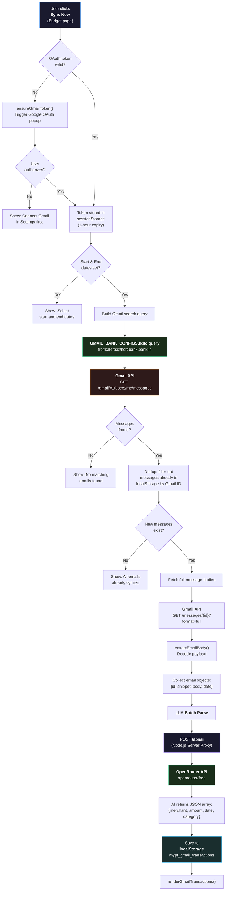
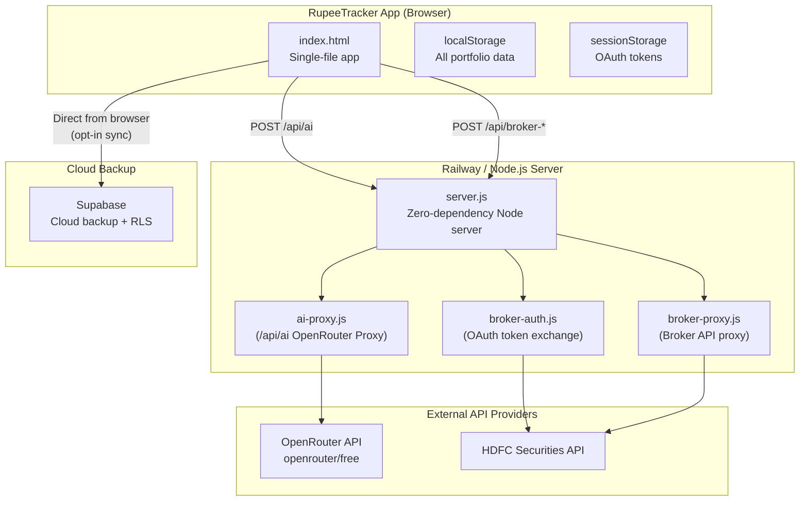

# RupeeTracker — Architecture Flow Diagrams

## 1. Gmail Expense Parsing & AI Proxy Flow

How bank transaction emails are synced, parsed, and processed via the Node.js server proxy (`/api/ai`).



---

## 2. Deployment Architecture

How the app runs locally or deploys on Railway using Node.js.



### How `server.js` Works

The server is a zero-dependency Node.js HTTP server that routes requests to `api/` handlers:

```text
Browser → POST /api/ai          → server.js → api/ai-proxy.js
Browser → POST /api/broker-auth → server.js → api/broker-auth.js
Browser → POST /api/broker-proxy→ server.js → api/broker-proxy.js
Browser → GET /                 → serves index.html
```

---

## Key Components Reference

| Component | Location | Purpose |
|-----------|----------|---------|
| `GMAIL_BANK_CONFIGS` | `index.html` | Bank-specific Gmail query templates |
| `syncGmailTransactions()` | `index.html` | Main sync orchestrator |
| `callAI()` | `index.html` | Sends AI prompts to `/api/ai` server proxy |
| `exports.handler` | `api/ai-proxy.js` | Server-side OpenRouter proxy handler |
| `supaUpsertAll()` | `index.html` | Push per-key data to Supabase |
